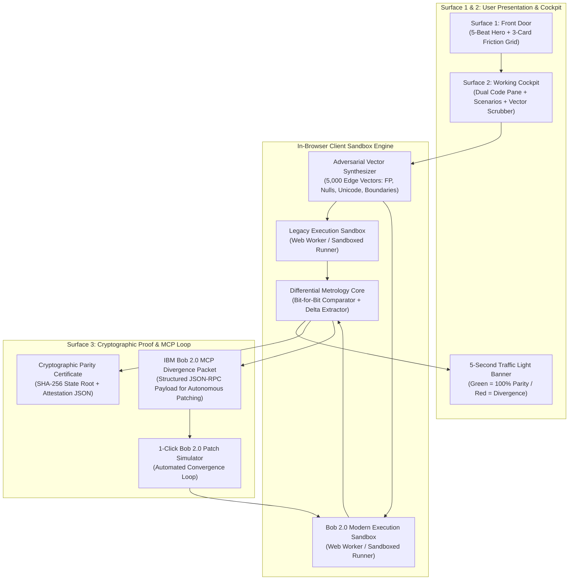

# Parity — Architecture

## Overview
Parity is a client-side differential behavioral equivalence engine built to verify AI-modernized code generated by IBM Bob 2.0. It ingests legacy enterprise code (or behavioral specifications) alongside Bob's modernized TypeScript/JavaScript implementations, synthesizes adversarial edge-case inputs in-browser, executes both implementations in isolated Web Worker sandboxes, performs bit-for-bit differential output analysis, and produces both human-actionable 5-second verdicts and machine-actionable MCP (Model Context Protocol) Divergence Packets.

---

## System Architecture Diagram



---

## Core Components

### 1. Adversarial Vector Synthesizer (`lib/engine/synthesizer.ts`)
- **Responsibility:** Deterministically generates boundary inputs targeting historical enterprise modernization failure modes:
  - IEEE 754 floating-point rounding quirks (`0.1 + 0.2`, precision decay, subnormals, negative zero).
  - Gregorian leap year edge cases (Feb 29 on century years, daylight saving jumps, ISO-8601 formatting).
  - Unicode normalization anomalies (NFC vs NFD, Turkish dotted/dotless `i`, zero-width spaces, case-folding drift).
  - Integer boundaries (Int32 overflow, BigInt precision, signed/unsigned wrap).
  - Nulls, undefined, and structural boundary payloads.
- **Performance:** Generates 5,000 deterministic pseudo-random vectors in <15ms.

### 2. Dual-Sandbox Micro-Executor (`lib/engine/executor.ts`)
- **Responsibility:** Executes legacy logic and Bob modernized logic in parallel client-side worker contexts with strict timeout and memory budgets.
- **Safety:** Runs in-browser without server execution, making Parity 100% static-hostable on Netlify with zero hosting vulnerabilities and zero backend server costs.

### 3. Differential Metrology Core (`lib/engine/comparator.ts`)
- **Responsibility:** Compares outputs bit-for-bit across all 5,000 vectors:
  - If identical: marks vector `PASS`.
  - If output, error state, or precision differs: marks vector `DIVERGENCE`, captures input vector, expected legacy output, actual modern output, and mathematical delta.
- **Metrics:** Computes Parity Score (0.00% to 100.00%), divergence count, max delta, and execution latency.

### 4. 5-Second Traffic Light Banner (`components/cockpit/TrafficLightBanner.tsx`)
- **Responsibility:** Enforces the Simple Product rule:
  - 🟢 **100.00% PARITY:** "All 5,000 execution vectors bit-identical. Safe for production release."
  - 🔴 **BEHAVIORAL DIVERGENCE:** "Divergence detected on vector #1,429 ($42,109.84 vs $42,109.80). Do not deploy."
  - Includes vector scrubber to jump directly to divergent inputs.

### 5. IBM Bob 2.0 MCP Divergence Generator (`lib/mcp/packetGenerator.ts`)
- **Responsibility:** Converts divergence records into an official IBM Bob 2.0 MCP tool payload:
  ```json
  {
    "mcp_version": "2026-03-01",
    "target": "ibm-bob-modernizer",
    "tool": "patch_behavioral_divergence",
    "parameters": {
      "legacy_module": "interest_calc_v1",
      "modern_module": "interest_calc_v2",
      "failing_vector": { "principal": 1000000, "rate": 0.0425, "days": 365 },
      "expected_output": { "interest": 42500.00000000001, "rounding_mode": "HALF_EVEN" },
      "actual_output": { "interest": 42500.00, "rounding_mode": "TRUNCATE" },
      "delta": "precision_loss_4_decimals",
      "suggested_fix": "Adopt Decimal.js or BigInt basis points to preserve legacy COBOL COMP-3 precision."
    }
  }
  ```

### 6. Cryptographic Attestation Certifier (`lib/crypto/attestation.ts`)
- **Responsibility:** Hashes input vectors, legacy outputs, and modern outputs using SHA-256 to produce an immutable, tamper-evident JSON receipt and cryptographic seal.

---

## Tech Stack

| Layer | Choice | Rationale |
|---|---|---|
| **Framework** | Next.js 15 (React 19, App Router) | Static export (`output: 'export'`) for zero-server Netlify CDN deployment. |
| **Styling** | Tailwind CSS v4 + Semantic Tokens | Ultra-clean obsidian slate theme, strict token hierarchy, zero layout shift. |
| **Icons** | Lucide React | High-authority, lightweight technical iconography. |
| **Syntax Highlighting** | PrismJS / Lightweight Tokenizer | Clean side-by-side legacy vs modern diffing without heavy Monaco bloat. |
| **Crypto** | Web Crypto API (`crypto.subtle`) | Native browser SHA-256 hashing for state-root attestation receipts. |
| **Hosting** | Netlify Edge CDN | 100% static hosting, instant global delivery, zero cold starts, zero Railway/daemon dependencies. |

---

## Key Decisions & Trade-Offs

- **Client-Side WASM/JS Sandbox vs Remote Container Execution:**
  - *Decision:* Execute all differential fuzzing vectors directly in the browser's JavaScript environment using Web Workers.
  - *Why:* Zero server costs, zero downtime, instant sub-millisecond execution, completely immune to backend timeout or credential expiration during hackathon judging.
  - *Trade-Off:* Scenarios are represented as sandboxed JavaScript/TypeScript equivalents of enterprise logic (e.g. COBOL COMP-3 math emulated in JS) rather than full multi-gigabyte mainframe emulators.

- **5-Second Traffic Light as Primary View vs Developer Metrology Wall:**
  - *Decision:* Large, visceral green/red traffic light banner is the prominent centerpiece. Advanced vector traces, raw hexadecimal dumps, and AST deltas are placed in expandable tabs.
  - *Why:* Hackathon judges spend 60–90 seconds reviewing a project. An impenetrable wall of debug logs confuses generalist judges; a clear "Green = Safe, Red = Divergence on Vector #1,429" proves value in 5 seconds.

---

## Preset Enterprise Scenarios
1. **Scenario 1: Banking Interest & Tax Calculator (Floating-Point Drift)**
   - *Legacy:* Java 8 `BigDecimal` with `ROUND_HALF_EVEN` banking rounding.
   - *Modern Initial:* Standard TypeScript `number` (IEEE 754 precision loss on multi-million dollar balances).
   - *Divergence:* Discrepancies appear on high-volume transactions ($0.04 drift per $1M).
   - *Bob 2.0 Patch:* Implements arbitrary precision basis-point arithmetic to achieve 100.00% parity.

2. **Scenario 2: Healthcare Claims Billing (Leap-Year Century Boundary)**
   - *Legacy:* 1990s C/COBOL century leap-year logic (century leap rules).
   - *Modern Initial:* Naive modern date library omitting 400-year Gregorian rule for historical records.
   - *Divergence:* Diverges on date inputs matching `2000-02-29` and `1900-02-28`.
   - *Bob 2.0 Patch:* Restores strict astronomical Gregorian leap-year validation.

3. **Scenario 3: FinCEN Sanction Tokenizer (Unicode Normalization Quirk)**
   - *Legacy:* ASCII-stripped uppercase mapping with legacy character folding.
   - *Modern Initial:* Modern `String.prototype.toUpperCase()` (breaks on Turkish dotted/dotless `I` and acute accents).
   - *Divergence:* Fails to flag restricted entity names containing special unicode diacritics.
   - *Bob 2.0 Patch:* Integrates compatibility-mode NFKD unicode normalization.
