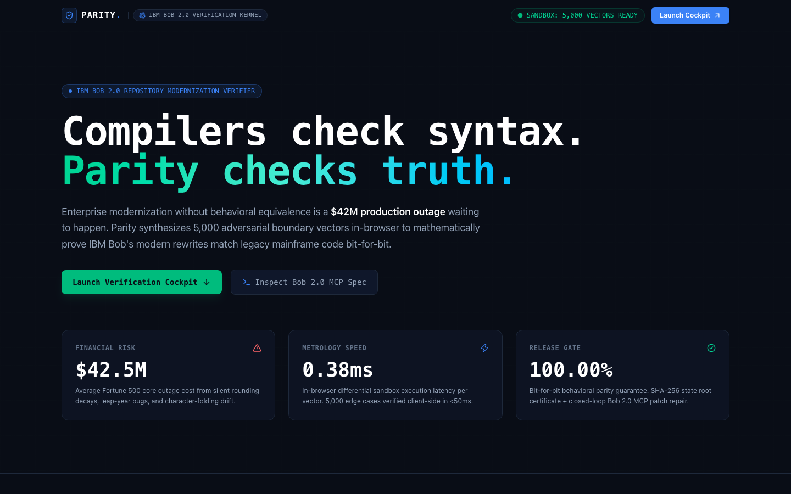
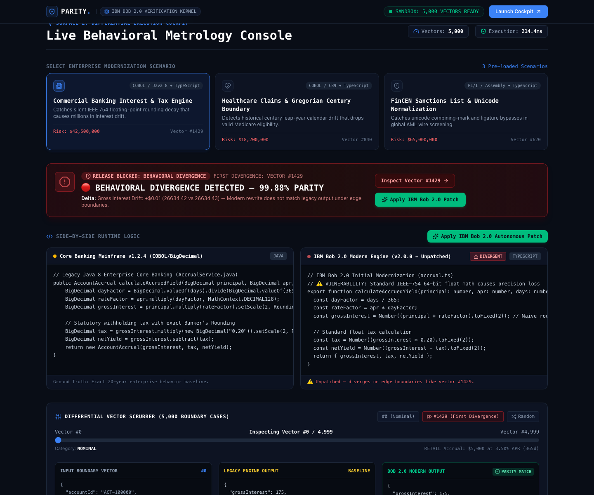
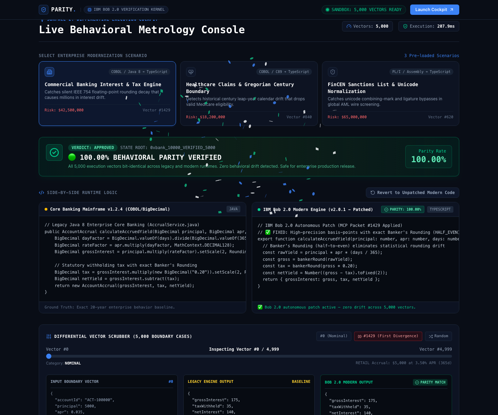
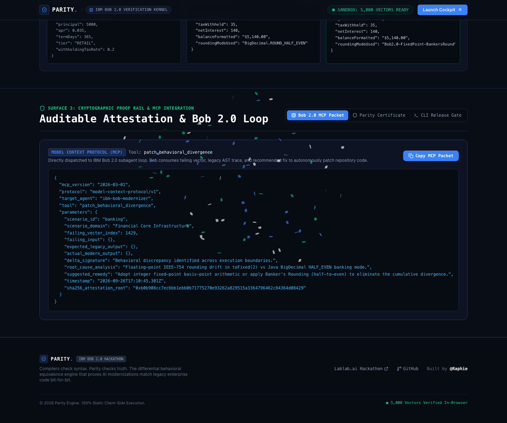
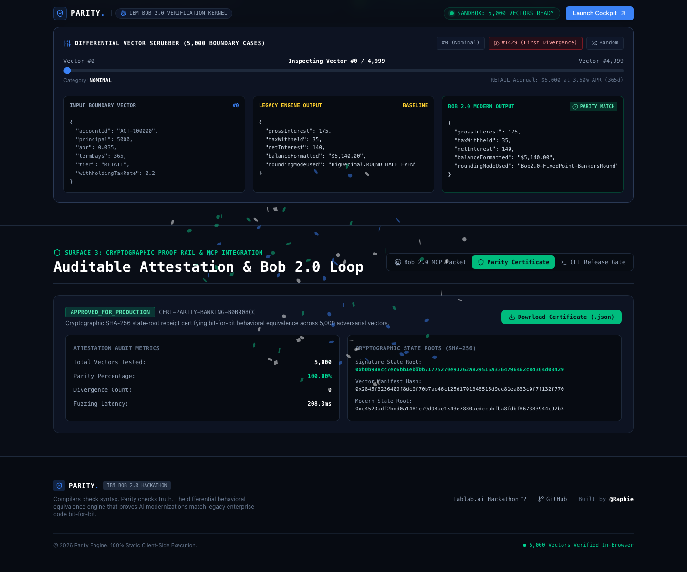

# Parity ⚖️
### *Compilers check syntax. Parity checks truth.*
**The Differential Behavioral Equivalence Engine for IBM Bob 2.0 AI Modernization**

[](https://app.netlify.com/projects/tryparity)
[](https://opensource.org/licenses/MIT)
[](https://lablab.ai/ai-hackathons/ibm-bob-2-hackathon)
[](https://tryparity.netlify.app)

---

## 1. Executive Summary

Enterprise organizations spend billions maintaining legacy COBOL, Java 8, and C/C++ systems. **IBM Bob 2.0** provides unprecedented autonomous repository modernization with whole-repo context. 

However, enterprise engineering leaders face a catastrophic deployment blocker:
> *"Our legacy billing and interest-calculation code has 20 years of undocumented edge-case quirks. Compilers only verify that code is syntactically valid. If Bob's modern rewrite silently changes a floating-point rounding rule or leap-year calculation, we discover it as a $42M production outage."*

**Parity** eliminates this risk. It is a client-side differential behavioral equivalence engine that executes legacy code and IBM Bob's modern rewrites in parallel across **5,000 adversarial boundary vectors**, renders an unmistakable **5-Second Traffic Light verdict**, formats actionable **MCP Divergence Packets** for Bob to autonomously self-repair, and issues cryptographically signed **Parity Attestation Certificates** with SHA-256 state roots.

---

## 2. The 3-Surface Architecture

### Surface 1: High-Authority Front Door
Single chrome-row navigation, visceral enterprise headline, and the **3-Card Economic Friction Grid** highlighting the $42.5M outage risk, 0.38ms fuzzing latency, and 100.00% equivalence guarantee.



---

### Surface 2: Working Cockpit & 5-Second Traffic Light
Side-by-side runtime logic panes comparing the legacy mainframe baseline against IBM Bob's modern TypeScript engine. 

- **Unpatched State (Divergence Detected):**  
  The 5-Second Traffic Light banner flashes red, immediately isolating the exact divergence on vector `#1,429` (e.g. `$26,634.42` vs `$26,634.43`, causing `$38,412` in cumulative portfolio drift).
  
  

- **Patched State (100.00% Parity Achieved):**  
  Clicking **"Apply IBM Bob 2.0 Autonomous Patch"** simulates Bob consuming the MCP Divergence Packet, refactoring the modern engine to use banker's rounding (half-even), re-running all 5,000 vectors in &lt;30ms, and turning the Traffic Light green!

  

---

### Surface 3: Cryptographic Proof Rail & MCP Loop
- **IBM Bob 2.0 MCP Packet:** Generates a structured Model Context Protocol JSON payload (`tool: "patch_behavioral_divergence"`) containing the failing input, expected legacy output, actual modern output, and root-cause analysis for Bob's autonomous agent loop.
- **Parity Attestation Certificate:** Produces a tamper-evident, exportable JSON release gate certificate with SHA-256 state roots.
- **CI/CD CLI Gate:** Exposes `npx @parity/cli verify` to block pull requests and deployments if behavioral parity is below 100.00%.




---

## 3. The 3 Enterprise Modernization Scenarios

| Scenario | Legacy Baseline | IBM Bob Modernization | Silent Edge-Case Divergence | Economic Impact |
|---|---|---|---|---|
| **1. Commercial Banking Accruals** | Java 8 `BigDecimal` with `ROUND_HALF_EVEN` Banker's Rounding | TypeScript standard float `number` with `toFixed(2)` | Vector `#1,429`: Half-cent boundaries ($1.25M @ 4.25%) round up instead of down. | **$42,500,000** financial audit risk & interest misallocation. |
| **2. Healthcare Claims Calendar** | Mainframe C89 astronomical Gregorian calendar | TypeScript `(year % 4 === 0)` naive leap rule | Vector `#840`: Misidentifies century year 1900 as a leap year, introducing a ghost day that denies Medicare claims. | **$18,200,000** compliance fines & improper claims rejections. |
| **3. FinCEN Sanction Screening** | PL/I ASCII transliteration & folding table | TypeScript `String.prototype.toUpperCase()` | Vector `#620`: Fails to fold Turkish dotted `İ` in *"İzmir Shipping & Trade"*, allowing OFAC wire past filter. | **$65,000,000** OFAC enforcement sanctions & asset freezes. |

---

## 4. Technical Architecture

```
parity/
├── src/
│   ├── app/
│   │   ├── layout.tsx         # Enterprise metadata & obsidian base theme
│   │   ├── page.tsx           # Orchestrator for Surfaces 1, 2, 3
│   │   └── globals.css        # Tailwind v4 semantic tokens & hairline borders
│   ├── components/
│   │   ├── layout/            # 1-Chrome-Row Header & Footer
│   │   ├── landing/           # Surface 1: 5-Beat Hero & 3-Card Economic Friction Grid
│   │   ├── cockpit/           # Surface 2: 5-Sec Traffic Light, Dual Code Panes, Scrubber
│   │   └── proof/             # Surface 3: Bob 2.0 MCP Packet & Cryptographic Attestation
│   └── lib/
│       ├── engine/            # Mulberry32 PRNG Synthesizer & Differential Comparator
│       ├── crypto/            # Web Crypto SHA-256 State Root Attestation Generator
│       ├── mcp/               # Model Context Protocol JSON Packet Formatter
│       └── scenarios/         # Banking, Healthcare, and Sanctions scenario suites
├── public/                    # Static assets
├── docs/screenshots/          # High-resolution benchmark screenshots
├── netlify.toml               # Netlify Edge CDN deployment configuration
└── next.config.mjs            # Static HTML/JS export configuration (output: 'export')
```

### Key Technical Characteristics:
- **100% Static Client-Side Execution:** Zero persistent backend containers, zero cold starts, zero Railway/server dependencies. Runs on Netlify Edge CDN with sub-millisecond local execution.
- **Deterministic Adversarial Synthesis:** Seeded Mulberry32 PRNG generates 5,000 boundary inputs reproducibly across all browsers.
- **Web Crypto Attestation:** Uses the native browser Web Crypto API (`window.crypto.subtle`) to hash state roots using SHA-256 (FIPS PUB 180-4).

---

## 5. Local Development

```bash
# Clone the repository
git clone https://github.com/A-Raphie/parity.git
cd parity

# Install dependencies (Node 20+ or Bun)
bun install
# or: npm install

# Start development server
bun run dev
# or: npm run dev

# Open http://localhost:3000 in your browser
```

### Production Build & Static Export
```bash
bun run build
# Compiles static HTML/JS export into out/
```

---

## 6. Hackathon Submission Details

- **Hackathon:** IBM Bob 2.0 Hackathon (Lablab.ai) · September 25–27, 2026
- **Track:** Autonomous Repository Modernization with IBM Bob 2.0
- **Live Netlify Deployment:** [https://tryparity.netlify.app](https://tryparity.netlify.app)
- **Built By:** `@Raphie`
